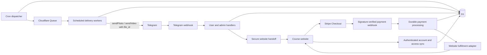

# Course Sales Bot: Feasibility and Implementation Plan

Prepared 2026-09-19 from the current project and official Telegram, Stripe, and Cloudflare documentation. Updated for website-based Stripe checkout and Telegram-hosted promotional media. Core messaging is now implemented in place; payment integration and launch work remain pending. The implementation status below is authoritative where it differs from proposed features.

## Recommendation

Rewrite this repository in place as a promotional bot, retaining only reusable Telegram interaction and infrastructure primitives, with Cloudflare D1 for business records, Workers for webhooks, and Cron plus Queues for delivery. The course and Stripe checkout live on a separate website. Admins upload promotional media directly to the bot; scheduled messages reuse Telegram file IDs. The technical design is feasible, with the external purchase-link policy review below required before launch.

The user explicitly chose an in-place rewrite. D1 replaces subscription KV storage; obsolete subscription commands, services, reports and tests are removed. Existing secrets are preserved, and old KV data is neither deleted nor migrated. Provision production D1/Queues and client-owned payment configuration before deployment.

Keep administration inside Telegram initially. Export user reports as UTF-8 text files; keep interactive campaign editing. R2 storage, a browser media uploader, video transcoding, and a self-hosted Bot API server are no longer required for the first release. This replaces the original R2 media requirement; the client retains original files separately for recovery.

## Confirmed Scope and Defaults

- One client and one externally hosted course initially. Support successive promotional sequences and independent calendar broadcasts from the first release. One-time purchase remains a provisional implementation default until pricing is supplied.
- The bot promotes the course; the external website owns checkout, customer accounts, and course delivery. Stripe replaces Telegram Stars in the proposed payment implementation, subject to the policy review below.
- Admins upload photos/videos to this bot. Store metadata and reusable file IDs, not media bytes; no Telegram-to-R2 transfer is planned.
- Enrollment starts on the first private-chat `/start`. Sending `/start` again shows the menu without restarting progress.
- Each sequence step has an offset from enrollment: for example, immediately, after 24 hours, and after 72 hours. Admins can also schedule a standalone message for all eligible users at a calendar date/time, independently of sequence progress.
- A verified website purchase for a linked user stops all promotion, including promotional broadcasts and future sequence enrollment. The website grants course access; the bot mirrors payment and access status.
- Existing eligible users receive newly published sequences after their current sequence finishes, without interrupting or replaying the current sequence. Define sequence publication separately from corrections to a version below.
- Expected acquisition is approximately 60 new users per day. Two admins have the same management permissions initially; each action is attributed to its actor.
- Both user and admin interfaces support Ukrainian (`ua`) and English (`en`). Legacy `uk` content remains readable; database locale columns and Telegram/Intl integration retain ISO `uk`. Business records are retained indefinitely by default, with the retention boundaries below.
- Admins manage the bot without being automatically enrolled as ordinary prospects. They can explicitly preview/test the sequence.
- Normal scheduled delivery targets minute-level timing, not exact-second delivery. Queue backlog and retries can add delay.
- Website integration and pricing details are deferred, not blockers for core development. Use adapter contracts and test doubles until these details arrive; do not enable an unconfigured live checkout.
- The admin owns and retains original media. A few actual photos/videos, including a typical large video, are delivery-test fixtures, not an additional product decision.
- Confirmation of the external payment flow's policy compliance is required before launch and has not yet been obtained.

## Telegram Constraints

### Course payments

Selected design: an HTTPS link opens the external course website, where the customer signs in and pays through Stripe-hosted Checkout. The bot does not collect card details, issue Telegram invoices, or deliver paid lessons. Telegram Stars handlers are outside this implementation scope.

Policy caveat and launch gate: Telegram requires Stars for digital-goods sales inside Telegram, even when a separate website exists. Its documentation does not establish a blanket exemption for a promotional bot linking to external checkout. Confirm the exact promotional copy, links, and purchase flow against Telegram's rules before enabling them in production; calling the bot a promoter or using HTTPS is not itself evidence of compliance. This plan records the requested Stripe architecture, not a claim that external checkout bypasses those rules. [Telegram digital-goods FAQ](https://core.telegram.org/bots/payments-stars#faq)

### Messaging and media

- Users must initiate contact before this bot can message them. `/start` is the proposed enrollment trigger. [Telegram bot introduction](https://core.telegram.org/bots)
- Private-chat `my_chat_member` updates report blocking/unblocking. Usernames and last names are optional. Treat names as display data, not identity. [Bot API types](https://core.telegram.org/bots/api#update)
- Reuse admin-uploaded media by `file_id`; no download or fresh upload is needed. Telegram documents no file-size limit for this resend path. IDs belong to a particular bot and retain their media type. The hosted API's 20 MB download ceiling therefore does not cap this workflow. Validate representative large uploads in the actual Telegram client and bot before launch. [Bot API file handling](https://core.telegram.org/bots/api#sending-files)
- Ordinary text is limited to 4096 characters; media captions to 1024. Validate content before publishing and support a separate text message after media. [Bot API send methods](https://core.telegram.org/bots/api#sendmessage)
- Budget below approximately 30 messages/second per bot and approximately one/second per private chat, handling rate-limit responses. [Telegram rate limits](https://core.telegram.org/bots/faq#my-bot-is-hitting-limits-how-do-i-avoid-this)

For this ordinary bot design, progress means the last successfully sent step and the next scheduled step. Do not present it as a read receipt or course completion: the normal Bot API update model provides no ordinary private-message read event. [Bot API updates](https://core.telegram.org/bots/api#update)

## User Experience

### Standard user

Commands: `/start`, `/course`, `/buy`, `/my_course`, `/stop`, `/resume`, `/language`, `/help`, `/terms`, `/privacy`, `/support`.

`/course` shows course information and the website link. `/buy` provides a secure website checkout handoff, not a Telegram invoice, subject to the launch gate above. `/my_course` shows synchronized purchase/access status and links to the website's authenticated course area. Existing website customers can securely link their Telegram identity. `/support` routes purchase issues to the website's support process.

On first start, explain the message sequence and provide a visible stop action. Record enrollment once, send the welcome step, and schedule later steps. Buying remains available after stopping promotional messages. `/stop` suppresses sequences and promotional broadcasts. `/resume` resumes remaining messages without replaying completed steps, or checks for an eligible new sequence if the previous one is complete. Resuming cannot override purchase-based suppression.

User state must distinguish promotional opt-out, Telegram blocking, payment, and access entitlement. Blocking or opting out must not erase a payment or prevent later recovery of purchased access.

### Languages

Use shared translation keys with complete `ua` and `en` catalogs for commands/help, menus, buttons, status labels, errors, confirmations, and admin tools. Accept older `uk` language callbacks as aliases for `ua`. Prefer Telegram's reported supported language on first contact; use English as the fallback and offer both choices through `/language`. Persist explicit selection and never overwrite it from later updates. Language is not a timezone.

Render scheduled system labels/actions in the recipient's saved language and admin previews in a selectable language. Keep authored promotional text distinct from interface translations: the editor supports per-language text/captions and optional media overrides, with a clearly selected fallback version when a translation is absent. Show missing variants and the fallback in publication preview; never silently machine-translate client content. Interface catalogs must be complete even when an admin chooses a single content language. A language change affects pending content, not already sent messages or sequence progress. Website localization is a separate integration concern.

### Admin user list

Send a downloadable UTF-8 text table containing every user matching the selected filter. There is no in-chat table or individual user selection. Include name, username, language, sequence progress and delivery status, availability, payment status, first interaction and last interaction.

| User | Sequence | Availability | Payment |
|---|---|---|---|
| @example / Alex | 3 of 7 sent | Reachable | Unpaid |
| No username / Sam | 5 of 7 sent | Blocked | Paid |

Refresh profile fields from new updates; existing profiles cannot supply names that were never saved. For an unlinked account, show payment as "Unknown / not linked". Extended history and website synchronization details may be added to the export when implemented.

Filters: all, payment unknown, unpaid, pending, paid, partially refunded, refunded, disputed, blocked, opted out, active sequence, completed sequence, and failed delivery. Start with stable pagination by creation time and ID. Exact username lookup can use a normalized keyed hash; broad name/substring search requires a separate privacy/indexing decision.

There are no per-user selection actions or delivery-review/manual-retry controls. Failed and uncertain sends stay held and their status appears in the report. Refunds are initiated through the website or Stripe Dashboard in the MVP and synchronized back to the bot.

Report filters remain interactive; each selected filter generates a complete text export. My course is the sole course-information menu entry; the separate Course button and command are removed.

### Message editor

Commands: `/admin`, `/users`, `/messages`, `/broadcasts`, `/payments`. Configure an allowlist containing both admin Telegram IDs; the current project's single `ADMIN_USER_ID` check needs adaptation in the rewritten app. Each admin command and callback checks this allowlist, including callbacks from old messages. Hidden buttons alone are not authorization. Use draft revision checks to prevent one admin from silently overwriting the other's changes.

Editor flow: choose sequence, create/edit step, enter text, attach photo/video, set delay, select audience rule, add the approved external course/checkout action, preview, save draft, publish. Store the action type in the draft; generate user-specific handoff links when sending, never reuse an admin's preview link for recipients.

Include reorder, disable, duplicate, cancel, and discard-draft controls. Store drafts outside the temporary conversation session so interrupted editing can resume. Preserve formatting entities or validate supported markup; escape user-supplied names in admin views.

MVP content is text plus an optional photo or video. Albums and multiple content blocks are feasible extensions, but require tracking each outgoing part separately.

Standalone broadcast flow: compose localized text/media, choose promotional or service purpose and audience, set a date/time in an explicit timezone, preview recipients and exclusions, confirm, and schedule. Provide reschedule/cancel before dispatch and delivery totals afterward. All-user broadcasts are independent of sequence position but cannot bypass reachability, opt-out, or purchase rules for promotional content. Service announcements may include purchasers only when explicitly chosen and must not be used to disguise promotion.

## What Can Be Reused

The rewrite retains [crypto primitives](../src/crypto), [rich-message presentation](../src/bot/ui/richMessage.ts),
[confirmation keyboards](../src/bot/keyboards/confirmationKeyboard.ts), and
[Telegram error classification](../src/utils/telegramErrors.ts).
The [Worker](../src/index.ts), [bot](../src/bot/createBot.ts), [D1 repositories](../src/repositories),
[campaign editor](../src/bot/campaignEditor.ts), and [delivery service](../src/services/deliveryService.ts)
replace the old subscription-specific implementation. grammY conversations, reports,
exchange rates, KV sessions and billing-date advancement are no longer dependencies.

## Implementation Status

Campaign messages now have admin-defined names and either elapsed-minute offsets or
relative local calendar rules (day offset, clock time, stored timezone, and campaign-start
or previous-message anchor). Both campaign and scheduled-message editors configure a
payment-status recipient segment while preserving purchase suppression. PNGs omit all
language metadata. Standalone date/time selection updates one combined calendar/clock
panel. Existing immutable snapshots remain readable and unchanged; unnamed legacy steps
use a content excerpt for display. Relative DST gaps shift forward and repeated autumn
times use the first occurrence; absolute calendar scheduling still requires an explicit
choice for repeated times. Payment synchronization remains outside the implemented scope.

Campaign overviews now distinguish published versions from drafts; opening a published
sequence does not create a draft until Edit campaign is chosen. Test setup and progress
are PNG reports. Cancelling a campaign removes its editing copies for all admins.
Deliveries is a separate single-message editor with its own durable drafts, a localized
calendar and hour/minute picker using CAMPAIGN_TIMEZONE. DST gaps are rejected and
repeated clock times require an explicit UTC-offset choice. Publication is confirmed
and revision-fenced. Existing broadcast dispatch, recipient suppression, cutoff and
expiry logic is reused without advancing sequence progress. Migration 0004 preserves
unfinished broadcast drafts while moving them out of the sequence editor.

Implemented and covered by automated tests:
- D1 migrations, encrypted user/media references, allowlisted admins and both interface languages.
- Durable webhook claims, first-start registration, opt-out and block tracking.
- Downloadable text user reports with profile details, current sequence position and delivery status.
- Photo/video upload inside campaign/scheduled-message editors, validated previews and refreshed reusable file IDs. No standalone media library or upload session.
- Persistent revision-checked localized drafts, per-step delays, previews, confirmed publish/cancel.
- Immutable versions, newest entry sequence for newcomers and ordered successors for existing users.
- Independent promotional broadcasts with a dispatch-time recipient cutoff.
- Durable delivery jobs, conditional claims, paced sends, transient retries and success-only progress.
- Failed/uncertain deliveries stay held without manual retry controls.
- Private admin campaign tests: fixed draft snapshot, the admin's locale/fallback, real timing or self-chained quick delivery about two seconds apart,
  per-message progress and cancellation, using the same Cron, queue and Telegram sender.

Current implementation limits:
- Campaign lists show the latest 30 campaigns; user exports include every matching user.
- Text plus one optional photo/video per step; no albums or formatting entities.
- Editing supports add/edit/remove, not dedicated reorder/duplicate controls.
- Broadcasts require an explicit ISO UTC offset, expire after 24 hours, and are promotional only.
- Existing enrollments retain their version. Correcting a campaign does not migrate active users.
- Extended report history, recipient-count previews, aggregate reports and service announcements remain planned.
- Website account linking, Stripe integration, payment/access history, support/terms configuration,
  deletion/anonymization, load testing and production provisioning remain unfinished.
- Checkout is intentionally disabled. No live payments, webhook registration or deployment were performed.

Local migrations and Worker readiness have been checked. Automated tests use SQLite and mocked
Telegram, not the owner's actual media or live Stripe. Configure ADMIN_USER_IDS before using
admin tools. Retain the launch gates and future acceptance criteria below.

## Storage and Data Model

KV is eventually consistent and is not intended for atomic transactional updates. That is unsuitable as the authoritative store for concurrent checkout processing and delivery claims. D1 supports transactional batches and SQL constraints; it is the recommended foundation here. [KV consistency](https://developers.cloudflare.com/kv/concepts/how-kv-works/), [D1 database API](https://developers.cloudflare.com/d1/worker-api/d1-database/)

Proposed records:

| Record | Main fields and invariants |
|---|---|
| `users` | Internal ID, unique Telegram-ID hash, encrypted identity/chat data, locale and explicit-language flag, timestamps, last known reachability, opt-out |
| `courses` | Website course ID, allowlisted website URL, Stripe Price ID, currency and integer minor-unit amount, active flag |
| `account_links` and `handoffs` | Verified website-account/user mapping; hashed, expiring, single-use handoff tokens and confirmation state |
| `sequences` and `sequence_versions` | Logical sequence ID, course, new-user entry flag, publication order, immutable published versions, draft revision, author |
| `sequence_steps` | Version, stable step ID, order, offset, localized text/entities, media references, content fallback language, audience rule |
| `enrollments` | User/course/sequence/version, enrollment and completion times, next step/due time, active/paused/completed/converted; unique user/logical-sequence pair |
| `broadcasts` and `broadcast_recipients` | Immutable scheduled content version, purpose, audience rule, UTC due time and entered timezone, expiry, creator, cancellation revision, recipient snapshot and outcomes |
| `media_assets` | Immutable content reference, media type, bot identity, current usable `file_id`, `file_unique_id`, available size/dimensions/duration, validation status and timestamp; no media bytes |
| `deliveries` | Sequence-step or broadcast source, user/part identity, due time, claimed lease, attempts, Telegram message IDs, sent/failed/unknown/skipped status; unique source/user/part |
| `orders` and `payments` | Website buyer/order, optional linked bot user, price/currency snapshot, unique Checkout Session and PaymentIntent IDs, payment/refund/dispute state |
| `payment_events` | Unique Stripe event ID, provider object reference, processing status, retry and reconciliation timestamps |
| `entitlements` | Mirrored website account/course access, granted/revoked/pending state, external enrollment reference and last sync; website is authoritative |
| `outbox` and `audit_events` | Durable work to dispatch, retry state, admin mutations and timestamps |

Use unique constraints for enrollment identity, delivery identity, Stripe event/payment IDs, account links, and website-account/course entitlement. Enforce at most one active promotional enrollment per user/course. Keep payment events as history rather than overwriting one boolean. Encrypt personal identity fields; keep operational timestamps/statuses queryable. Queue payloads carry internal record IDs, never names or media bytes. Do not store card details or log checkout URLs, handoff tokens, raw webhook bodies, or customer identifiers.

KV can remain an optional cache or temporary UI-session store. It must not be the source of truth for money, enrollment, or delivery completion. Use persistent drafts and version checks to tolerate concurrent admin edits.

### Retention and capacity

The requested default is indefinite retention of business records: users, sequence/broadcast history, payment/access history, authored content/media references, and admin audit events. Do not automatically erase those records after sequence completion, inactivity, blocking, or purchase. Temporary sessions, checkout handoffs, leases, and credentials still expire; retaining records forever must not keep security tokens valid forever. Logs and backups need their own documented retention and access policy.

Indefinite retention is a client requirement, not confirmation of privacy compliance. Review the retention notice and any applicable deletion/anonymization obligations before production. Provide a controlled deletion/anonymization process where required; a restored backup must not silently resurrect deleted identities. The admin retains original media outside this application; a retained file ID is not an independent file backup.

At 60 new users/day, plan for roughly 21,900 additional users/year, plus accumulated delivery records. Use indexed due queries, stable pagination, bounded broadcast fan-out, backup/restore checks, and storage/cost monitoring. Initial acquisition is modest, but an all-user campaign can target years of accumulated users; test that volume rather than assuming 60 recipients per broadcast.

## Scheduling and Reliability

1. `/start` transactionally creates a missing enrollment in the current entry sequence and its first delivery job. Repeated starts cannot reset it or replay an already completed sequence.
2. Store future times in D1. Run a short bounded due-job scan every minute; the existing configuration runs only every thirty minutes. Use indexed due times rather than scanning every user. [Cloudflare Cron](https://developers.cloudflare.com/workers/configuration/cron-triggers/)
3. Commit work to an outbox before dispatching it. Enqueue by job ID; retry pending outbox entries after dispatcher failures.
4. The consumer atomically claims a delivery with a lease. Immediately before sending, recheck sequence/broadcast version, cancellation, opt-out, blocking, purchase state, and prior completion. Serialize due work per recipient across both sources so broadcasts and sequence steps share pacing without overlapping sends.
5. Record returned Telegram message IDs and advance the sequence only after confirmed success. Store separate part results when one step needs media plus text.
6. Retry transient failures with bounded backoff and Telegram retry timing. Confirmed blocking pauses delivery; other permanent recipient errors are marked unreachable rather than blindly labeled blocked. Invalid credentials or broken content raise operator alerts.
7. Recover expired leases and expose failed/uncertain jobs to the admin. Use shared pacing across delivery workers, with conservative throughput and headroom for interactive replies.

Queues are at-least-once, so duplicates are possible. Database uniqueness and claims suppress repeated processing, but no local transaction can atomically include Telegram sending. A send accepted by Telegram followed by a lost response or database failure leaves an uncertain outcome. Record that explicitly; choose delayed retry versus admin review by message importance. Do not promise exactly-once message delivery. [Queue delivery guarantees](https://developers.cloudflare.com/queues/reference/delivery-guarantees/)

Queue delays are capped at 24 hours, so the queue alone is not a multi-day campaign calendar. Keep the long-term schedule in D1 and enqueue due work. [Queue delays](https://developers.cloudflare.com/queues/configuration/batching-retries/)

For downtime, propose sending only the next overdue sequence step and preserving a minimum spacing before later steps, rather than sending an entire backlog at once. A broadcast has an explicit expiry or an admin-selected "deliver even if late" policy; expired campaigns are skipped. Relative elapsed delays need no inferred user timezone. Calendar scheduling requires an admin-selected IANA timezone, stores the resulting UTC instant, and shows both in confirmation; reject nonexistent daylight-saving times and require a choice for ambiguous times. No production timezone is assumed from the developer's machine or the UI language.

### Independent calendar broadcasts

"Outside the queue" means outside the user's ordered promotional sequence, not bypassing the Cloudflare delivery queue. A broadcast does not change sequence progress and can reach users whose sequence is active or finished. Reuse the reliable dispatcher, queue, media sender, and delivery ledger for both sources.

Default audience is all non-admin contacts who started the bot, excluding blocked/unreachable users and promotional opt-outs. Promotional broadcasts additionally exclude known purchasers and users with purchase-based suppression. An explicit service-announcement audience may include purchasers but still respects delivery preferences and reachability. Show these exclusions and a recipient estimate before scheduling; normal admin accounts receive only explicit previews/test sends.

Default membership is evaluated when dispatch begins: capture a cutoff and durably materialize recipients in bounded, restartable batches with uniqueness constraints. Later joiners do not enter that broadcast; users who become ineligible after the snapshot are skipped at send time. Cancellation invalidates unsent work, not messages already accepted by Telegram. Editing after dispatch begins requires a new broadcast for unsent recipients with an explicit preview/confirmation, never a silent resend to completed recipients.

An all-user campaign starts dispatch at its scheduled time but reaches recipients progressively under rate limits; do not promise simultaneous arrival. For collisions, prioritize due standalone broadcasts over a sequence step for the same user, then deliver the delayed step with the configured spacing and without advancing it prematurely.

## Safe Editing of Active Sequences

Published sequence versions should be immutable. Distinguish a new logical sequence (a fresh campaign existing users should receive) from a correction/version of the same sequence. The editor makes this choice explicit in the publication confirmation. Existing active users finish their pinned version; a corrected version does not automatically replay that same logical sequence after completion.

On publication of a new logical sequence, eligible users whose current sequence is complete enroll automatically. Active users become eligible when they finish. If several new sequences are waiting, the proposed default is publication order, oldest unseen first; complete each before starting the next. A new user's first `/start` enters the current admin-designated entry sequence, not the entire historical catalog. Later sequences are those published after that entry sequence; withdrawn/archived campaigns are skipped.

Start each successor's offsets at its own enrollment time, honoring the configured minimum inter-message gap; do not backdate messages to the user's original `/start`. Both publication and completion trigger an idempotent eligibility check, with periodic reconciliation to recover races. Unique user/sequence enrollment and one-active-enrollment constraints prevent duplicate starts. Exclude paid/purchase-suppressed, opted-out, blocked, and administratively paused users. Resume/unblock rechecks eligibility without resurrecting completed work or overriding purchase suppression.

Provide a separate "Apply correction to active users" action with an affected-user count and confirmation. It maps stable step IDs, changes only pending work, invalidates stale queued jobs, and never automatically resends completed steps. Archive steps/media still referenced by active enrollments rather than deleting them. Retain completed history indefinitely under the retention policy.

This policy prevents reordering a message from silently changing the meaning of "step 3" for a user already midway through the sequence. Updating previously sent Telegram messages is outside the MVP.

## Telegram Media Workflow

1. An authorized admin uploads a photo or video directly to this bot during message editing. Capture its metadata and file ID from the update; for photos select the largest provided size. Store a pending asset record without downloading anything.
2. Preview by sending the asset back to the admin with `sendPhoto` or `sendVideo` and its file ID. Require a successful preview before marking the asset ready and publishing the step. Unsupported document uploads are rejected with a request to send a photo/video, or handled later as a distinct document feature.
3. Scheduled delivery loads the asset's current usable `file_id` and passes it to the matching send method. Do not call `getFile` as a validation/refresh mechanism; downloading is unnecessary and would reintroduce the hosted API download limit.
4. Record a newly returned file ID for the same asset and bot after successful previews/sends or an explicitly verified re-upload. `file_unique_id` is a matching aid, not a sendable ID. There is no periodic refresh job or promise that only the most recently observed ID works; multiple valid IDs can identify the same file. [Bot API file identifiers](https://core.telegram.org/bots/api#file)
5. Distinguish reference repair from content replacement: repairing a confirmed identical asset may update its delivery reference; a different photo/video creates a new asset and follows sequence versioning. Preserve old assets referenced by active enrollments.
6. On an invalid/unusable file reference, mark the asset as needing admin attention, hold affected deliveries without advancing progress, and request a re-upload to this bot. After a successful repair preview, retry only pending/failed deliveries. Network and rate-limit failures remain ordinary delivery retries, not evidence that media needs replacement.

A new bot identity requires uploading assets to that bot; file IDs are not portable between bots. This design avoids a 20 MB ingestion cap but still requires end-to-end testing with the admin's actual photos/videos, including a typical large video, to verify preview, media type, and repeated scheduled sends. This is what "representative media" means; no file sizes must be chosen before core development. Telegram is the delivery store, not an independent backup. The admin owns and retains originals; optional R2 archiving is a later scope change, not part of scheduled delivery. Course lessons remain on the external website.

## Payment and Access Workflow

### Secure website handoff

1. Generate a high-entropy, opaque, expiring handoff token, store only its hash, and send an HTTPS link to an allowlisted course-domain route. Do not put raw Telegram IDs, usernames, prices, or reusable login credentials in the link. An expired message link leads to a fresh handoff request, never a weaker authentication path.
2. The website requires login or verified account creation. A forwarded link must not silently bind the recipient's account to the original Telegram user: require explicit confirmation in that user's bot chat before creating a new account link. Check existing mappings and require re-verification to change them. A handoff token is not a course-access credential.
3. Redeem the token once on an explicit authenticated action, not a GET that a link preview might visit. Use CSRF protection, rate limits, a clean redirect after redemption, and token redaction in logs/referrers. Store the confirmed website-account/bot-user relationship server-side.
4. The website creates a Stripe Checkout Session using a server-selected Price ID and an opaque internal order reference in `client_reference_id`/metadata. Never trust client-provided amount, currency, user mapping, or return URLs. Use a stable per-order idempotency key for creation retries and retain the Session ID. [Stripe Checkout Session creation](https://docs.stripe.com/api/checkout/sessions/create)

Existing customers can use the same verified linking process and have their website purchase history reconciled without buying again. Website purchases without a bot link remain unassigned to a bot user until verified linking succeeds; a matching name, email typed in chat, or possession of a Checkout URL is insufficient proof.

### Payment confirmation and synchronization

Use a dedicated Stripe webhook endpoint, separate from Telegram's webhook and conversations. Verify `Stripe-Signature` against the unmodified request body with the endpoint's signing secret. Match the configured Stripe account and test/live environment. Durably record accepted events before returning success; return a retryable error on persistence failure. Process accepted work asynchronously with retries. Track event IDs and provider object IDs, tolerate duplicate/out-of-order events, and reconcile current provider state when needed. [Stripe webhook security and delivery](https://docs.stripe.com/webhooks)

Handle `checkout.session.completed` and, when delayed payment methods are enabled, `checkout.session.async_payment_succeeded` / `checkout.session.async_payment_failed`. A completed Session alone is not proof of payment: verify paid status and match the order, course, amount, and currency before fulfillment. A browser redirect or query parameter never marks an order paid. Record Session expiry separately from a failed payment. [Stripe Checkout fulfillment](https://docs.stripe.com/checkout/fulfillment?payment-ui=stripe-hosted)

Persist confirmed payment, promotional-enrollment conversion, and the synchronization/fulfillment outbox atomically. The website is the only course-access authority: the adapter requests idempotent website enrollment and mirrors its result, never grants an independent Telegram entitlement. If the existing website already handles Stripe and enrollment, reuse that owner and consume its authenticated synchronization events instead of implementing a second fulfiller. Final ownership is deferred: implement the adapter contract/test double now and choose the live integration when website details arrive. Failed website synchronization is retried and shown separately from payment success.

Suggested admin payment states: unknown/not linked, unpaid, checkout pending, processing, paid, failed, partially refunded, refunded, disputed, and needs review. No receipt does not prove checkout cancellation. Track access separately as pending, granted, revoked, or sync failed. Reconcile website purchases when accounts are linked and periodically recover missed updates; until then, do not present stale status as authoritative.

Keep refund history, including pending/failed and partial refunds; update financial totals only from verified provider state. Refund actions remain on the website/Stripe Dashboard in the MVP. Handle dispute changes without allowing an older payment-success event to overwrite a refund or re-grant revoked access. The client defines access handling for full/partial refunds and disputes. [Stripe refunds](https://docs.stripe.com/refunds)

After a verified linked purchase, suppress current and future promotional sequences and promotional broadcasts; a message already in flight or a delayed payment synchronization can still result in a promotion arriving after purchase. Do not automatically restart promotions after a refund. Explicitly non-promotional service announcements remain a separate audience choice. Paid lessons in the bot, Telegram channel membership, Stars invoices, and in-bot refund execution are outside this release.

### Configuration boundary

Plan for `COURSE_WEBSITE_URL`, `STRIPE_SECRET_KEY`, `STRIPE_WEBHOOK_SECRET`, a configured Stripe Price ID, and authenticated website-sync credentials. Stripe secrets belong only in the backend that owns Checkout/webhooks; a bot that only consumes website sync must not receive unnecessary Stripe privileges. Keep test/live credentials separate. Add applicable variables to the rewritten app's environment types, schema, example file, and README during implementation; do not change this subscription bot's `.dev.vars` for this plan.

Also configure the two-admin allowlist (`ADMIN_USER_IDS` in the rewritten app) and an explicitly selected campaign timezone. Website URL/APIs, live price/currency, and commercial policies are intentionally deferred. Develop against synthetic adapters and Stripe test data without inventing production values. Before integration is ready, `/buy` reports checkout unavailable in all three languages and cannot create live charges or fabricate a paid status. Core admin, media, localization, sequence, and broadcast work can proceed independently.

## Implementation Phases

| Phase | Concrete deliverable | Acceptance checks |
|---|---|---|
| 1. Foundation | In-place app rewrite, D1 migrations, two-admin allowlist, user capture, locales, enrollment, adapter contracts | Duplicate `/start` does not restart; non-admin callbacks rejected; missing website/price does not block core flows |
| 2. Admin UI | User lists, sequence/broadcast editors, persistent drafts, complete Ukrainian/English interface catalogs | Missing usernames work; concurrent admin edits are detected; language selection persists; previews never broadcast |
| 3. Media | Admin uploads, metadata/file-ID storage, preview, reference repair, Telegram reuse | Representative large media resends without download; wrong-bot/invalid references cannot publish; replacement respects versions |
| 4. Scheduler | Relative sequences, successor enrollment, calendar broadcasts, recipient snapshots, outbox/claims, pacing/retries | Completed users enter new sequences once; broadcasts preserve progress; cancellation, purchase, opt-out, timezone/DST, and restart rules hold |
| 5. Website Payments | Secure handoff/account linking, Stripe Checkout/webhook integration, website access and payment sync | Forwarded/tampered links cannot mislink accounts; unconfirmed/delayed payments cannot grant access; duplicate events are safe |
| 6. Launch | External purchase-flow confirmation, retention review, Stripe tests, accumulated-audience load tests, monitoring, backup/restore, HTTPS webhooks | All three languages and both admins verified; approved purchase flow synchronizes; indefinite history and recovery tested; no sensitive logs |

Reuse the current TypeScript/lint/Vitest checks. Add focused integration tests for expired/replayed/forwarded handoffs, website account-link confirmation, forged webhook signatures, wrong environment/amount/currency, delayed/duplicate/out-of-order Stripe events, refund-before-success replay, unlinked purchases, website sync outages, and payment events during a bot conversation. Cover concurrent publishing, stale queued work after purchase, block/unblock, large file-ID sends, invalid-reference repair, and a crash after Telegram accepts a send. Use synthetic users and Stripe test mode, not real customer charges.

Add coverage for publication/completion races, multiple pending successors, corrections versus new sequences, no replay after repeated `/start`, purchase suppression across both scheduling modes, cancellation after partial broadcast delivery, recipient cutoffs, broadcast/sequence collisions, and timezone/DST validation. Validate translation-key parity, localized callbacks/errors, explicit language persistence, and content fallback previews. Test two-admin conflicts, business-record preservation, expiring security tokens, and adapter-unavailable states. Use accumulated multi-year recipient counts in broadcast tests, not just daily acquisition.

The website's authentication/payment/enrollment APIs and final Stripe configuration are deferred integration tasks, not blockers for core implementation. External purchase-flow confirmation remains a launch gate. Media work is limited to Telegram upload/reuse and recovery, not file storage or transcoding. Capacity planning starts at 60 new users/day and includes long-term accumulation; no exact schedule or cost is implied by this plan.

## Decision Register

| Item | Decision / status |
|---|---|
| Scheduling | Confirmed: relative sequences and independent all-user calendar broadcasts, both using reliable queued delivery |
| Website | Deferred, non-blocking for core development: domain, account and course APIs, existing Stripe ownership |
| Volume and media | Confirmed: about 60 new users/day; admin owns originals and uploads to Telegram; actual-media testing before launch |
| Commercial settings | Deferred, non-blocking: Stripe currency/Price ID, payment methods, final billing model, refund/dispute/support policies; one-time is provisional |
| Purchase and successors | Confirmed: purchase stops promotion; eligible existing users receive new sequences after the current one finishes |
| Administration and retention | Confirmed: two admins; indefinite business-record retention by default, subject to the documented privacy/security boundaries |
| Languages | Confirmed: complete Ukrainian, English, and Polish interfaces for users and admins |
| Policy confirmation | Required before launch, not yet received; requesting confirmation does not mean approval has been obtained |

Non-blocking proposed defaults to validate during implementation: oldest-unseen successor order, distinction between new campaigns and corrective revisions, current entry sequence for newcomers, broadcast audience snapshot at dispatch, authored-content fallback language, and minimum spacing/late-delivery policy. Admins must select the calendar timezone before scheduling; it is not inferred. No need to wait for these integration details to build and test the core system.

Recommended first release: one externally hosted course, successive relative promotional sequences, independent calendar broadcasts, website-based Stripe checkout, verified account linking/payment sync, two-admin Telegram management, both interface languages, indefinite business history, and media reuse by file ID. No R2, browser media uploader, or paid Telegram content is required. Add complex branching, albums, archival media storage, and a full web dashboard only when required.
